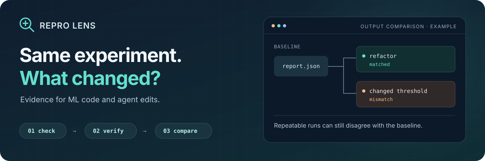

<p align="center">
  
</p>

<p align="center">
  <a href="https://github.com/00200200/repro-lens/actions/workflows/ci.yml"></a>
  <a href="https://github.com/00200200/repro-lens/releases/latest"></a>
  <a href="pyproject.toml"></a>
  <a href="LICENSE"></a>
  <a href="https://github.com/00200200/repro-lens/stargazers"></a>
</p>

<p align="center">
  <a href="https://00200200.github.io/repro-lens/"><b>Explore in your browser</b></a> ·
  <a href="#try-the-beforeafter-demo"><b>Run the demo</b></a> ·
  <a href="examples/README.md">Browse examples</a> ·
  <a href="#install">Install</a> ·
  <a href="#framework-checks">Framework checks</a> ·
  <a href="#coding-agents">Coding agents</a> ·
  <a href="CONTRIBUTING.md">Contribute</a> ·
  <a href="docs/support.md">Community support</a>
</p>

# Repro Lens

**Your refactor runs twice. Did it keep the same results?**

Catch reproducibility risks before a commit, replay an experiment, and compare
outputs before and after a change. Built for ML developers and coding agents.

| Command | Question it answers | Evidence |
| --- | --- | --- |
| **`check`** | Is there a known reproducibility risk in this code? | Static findings with file locations; scanned code is never imported |
| **`verify`** | Do two runs produce matching declared outputs? | Metrics, artifact hashes, commands and logs |
| **`compare`** | Did the edit preserve the baseline outputs? | Differences between saved reports, including changes that need separate review |

The static checker needs **Python 3.11+**, with **no ML dependencies or API key**.
Replay runs your configured experiment and needs its dependencies.
Use the CLI, an opt-in [pre-commit hook](#pre-commit), [GitHub Actions](#github-actions), or the
[reproducibility skill](skills/reproducibility/SKILL.md) in your coding agent.

## Try the before/after demo

**Start without installing:** [explore the browser gallery](https://00200200.github.io/repro-lens/)
to search checked code pairs by framework or finding, or
[paste your own script](https://00200200.github.io/repro-lens/#check). The live check
runs the same analyzer as the CLI in your browser with Pyodide; your code is not
uploaded or executed.

Want a specific workflow? [Browse examples by question, dependencies and expected result](examples/README.md).

With Python 3.11+, Git and [uv](https://docs.astral.sh/uv/getting-started/installation/), run from a directory where `repro-lens` does not already exist:

```bash
git clone https://github.com/00200200/repro-lens.git
cd repro-lens
uv run --no-dev python examples/agent_review/demo.py
```

```text
Scenario             verify     compare with baseline
baseline             matched    -
refactor             matched    matched
changed threshold    matched    mismatch
changed tolerance    matched    not_comparable
```

All four variants reproduce their own outputs. The changed threshold still disagrees with the baseline. Changing the tolerance requires a separate review.

The [demo](examples/agent_review/) uses a tiny synthetic classifier and scripted edits. It runs without ML dependencies or an API key and retains the actual reports. To check a real coding agent's work, use the [agent workflow](docs/agent-review.md).

For actual model training, try the [XGBoost CPU replay example](examples/xgboost_review/):
it installs its own locked dependencies and checks whether a refactor or a tree-depth
change preserves predictions on a small synthetic fixture.

## Install

With [uv](https://docs.astral.sh/uv/getting-started/installation/):

```bash
uv tool install 'git+https://github.com/00200200/repro-lens.git@v0.3.1'
```

Or use `pip install 'git+https://github.com/00200200/repro-lens.git@v0.3.1'` in a virtual environment. Both commands require Git. No NumPy, scikit-learn or API key is needed for static checks.

[Walk through a complete example](docs/quickstart.md), or scan a project you already have:

## Check an existing project

Start with the [advisory rollout guide](docs/trying-an-existing-project.md) to review
findings before making them block commits.

```bash
repro-lens check --root /path/to/project
repro-lens check --root /path/to/project --format json
```

For example:

```python
from sklearn.model_selection import train_test_split

train_test_split(X, y)  # R101: no explicit random_state
```

The checker recognizes imported aliases, skips non-shuffled splits, and reports dynamic arguments as unresolved. Warnings can be justified with an inline comment. All rules and their limits are described in [docs/rules.md](docs/rules.md).

Explicit seed expressions are accepted without evaluating their values. A clean scan is a useful review signal, not proof that the experiment is reproducible.

## Framework checks

Static checks cover selected APIs in **scikit-learn, XGBoost, LightGBM, PyTorch,
TensorFlow and Lightning**, plus Python and NumPy RNG construction. Install none
of these frameworks to scan their code.

| Framework | What gets checked |
| --- | --- |
| scikit-learn | Explicit randomness control in supported splits, estimators and datasets |
| XGBoost | `gblinear` with the nondeterministic `shotgun` updater, even with a seed |
| LightGBM | CPU determinism, device choice and forced histogram configuration |
| PyTorch | DataLoader/random_split generators, cuDNN benchmarking and deterministic mode |
| TensorFlow | Generators explicitly initialized from nondeterministic state |
| Lightning | Trainer determinism, warning-only mode and benchmarking |
| Global RNG state | NumPy, Python, PyTorch or TensorFlow global randomness used in a file that never seeds it (review) |

Known risks are warnings; settings that may be controlled elsewhere are nonblocking
`review` items. Native boosting `train`/`cv` calls accept inline parameter dictionaries.
The development checkout also resolves simple dictionaries assigned once and used
once in the same block of code.
Aliases and justified suppressions work across frameworks. See the exact
[API coverage, examples and limits](docs/frameworks.md).

Run the dependency-free [framework examples](examples/framework_checks/):

```bash
uv run --no-dev python examples/framework_checks/demo.py
```

The framework checks, notebook scanning, named-dictionary support and global RNG
reviews (R111–R114) are included in v0.3.1. Use the versioned installation above,
or `uv tool install .` from this checkout.

## Try a complete experiment

```bash
repro-lens init repro-demo --name repro_demo
cd repro-demo
uv sync --locked
uv run pytest
repro-lens check
repro-lens verify
```

The example uses a committed synthetic CSV and a scikit-learn pipeline. `verify` launches two separate processes, compares metrics and prediction artifacts, and saves commands, logs, input hashes and results in `.repro-lens/verify/`.

Metrics use explicit tolerances. Artifacts use SHA-256. Missing outputs, nonfinite metrics, failed commands, timeouts and changed inputs are errors. See the [verification contract](docs/verification.md) to configure another experiment.

A clean static scan does not prove repeatability. A two-run match applies to the declared outputs in that environment. `verify` executes the configured command with your permissions; review it before running unfamiliar code.

## pre-commit

Add this to `.pre-commit-config.yaml`. [pre-commit](https://pre-commit.com/#install) installs the checker in its own environment:

```yaml
repos:
  - repo: https://github.com/00200200/repro-lens
    rev: v0.3.1
    hooks:
      - id: repro-lens
```

Then run `pre-commit install` and `pre-commit run --all-files`. The hook screens code and project policy; experiment replay stays an explicit command. Run a full scan and replay in CI as well.

## GitHub Actions

Findings appear as annotations on the changed lines of a pull request:

```yaml
jobs:
  repro-lens:
    runs-on: ubuntu-latest
    steps:
      - uses: actions/checkout@v4
      - uses: 00200200/repro-lens@main  # pin a release tag or commit SHA once one includes the action
        with:
          root: .            # project directory inside the checkout
          fail-on: warning   # or `error` to keep warnings advisory
```

The action uses the runner's Python 3.11+ when there is one, or a uv-managed Python
otherwise; it installs no packages into your environment. Review items appear as notices
and never fail the step. Notebook findings are attached to the notebook file, with the
cell and line in the message. GitHub limits how many annotations a step can show; the
step log always lists every finding.

To keep results in the repository's code scanning alerts, write SARIF and upload it:

```yaml
    permissions:
      contents: read
      security-events: write
    steps:
      - uses: actions/checkout@v4
      - uses: 00200200/repro-lens@main
        with:
          sarif-file: repro-lens.sarif
      - uses: github/codeql-action/upload-sarif@v4
        if: always()
        with:
          sarif_file: repro-lens.sarif
```

Outside Actions, `repro-lens check --format sarif` and `--format github` produce the same
output. Paths are relative to the current directory when `--root` is inside it, so run
the command from the repository root.

## Coding agents

Use the [agent change-review workflow](docs/agent-review.md) to retain a baseline,
verify after an edit and compare the recorded outputs:

```bash
repro-lens compare /path/to/before/report.json /path/to/after/report.json --format json
```

Two successful runs after a refactor can still disagree with the baseline. Comparison
reports output differences and changed inputs; a changed output contract or recorded
environment requires separate review.

[skills/reproducibility/SKILL.md](skills/reproducibility/SKILL.md) guides an existing coding agent through an audit or an authorized repair. Its launcher calls the same engine as the CLI. The complete repository is also a Codex plugin with `.codex-plugin/plugin.json`.

Example request:

> Use the reproducibility skill to refactor this training script while preserving its declared outputs. Local verification is authorized. Capture a baseline before editing and compare it with the changed experiment.

The skill distinguishes source-level risks from observed execution results. It does not start a separate LLM service or require an API key. For standalone skill installation, install the CLI too; the full plugin checkout already includes its engine.

## Community support

Repro Lens is free and open source. For questions, bug reports and suggestions,
see the [community support guide](docs/support.md). You can help by sharing a
minimal reproduction, improving the documentation or contributing a fix.

## Development

```bash
git clone https://github.com/00200200/repro-lens.git
cd repro-lens
uv sync --locked
uv run pytest
uv run ruff check .
uv run ruff format --check .
uv build
```

Contributions need both a failure example and valid code that the rule must leave alone. See [CONTRIBUTING.md](CONTRIBUTING.md) and the [architecture decision](docs/architecture.md).

Early release: framework coverage is deliberately limited to documented APIs. Arbitrary
wrappers, whole-program data flow and notebook execution order are not yet supported;
notebook code cells are checked on the development branch. `init` still generates
a scikit-learn project; `verify` and `compare` use a framework-independent output contract.
The package is not published to PyPI. No comparative accuracy or SOTA claim is made.

Try it on one training script. If it misses a supported call or flags valid code, [open an issue](https://github.com/00200200/repro-lens/issues/new) with a minimal example. If you find it useful, a star helps other maintainers discover it.

MIT licensed.
