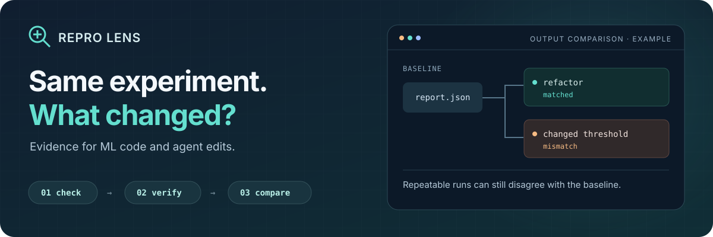

<div align="center">
  

  <h1>Repro Lens</h1>

  **Your refactor runs twice. Did it keep the same results?**

  [](https://github.com/00200200/repro-lens/actions/workflows/ci.yml)
  [](https://github.com/00200200/repro-lens/releases/latest)
  [](pyproject.toml)
  [](LICENSE)
  [](https://github.com/00200200/repro-lens/stargazers)

  <br>

  [**Explore Demo**](https://00200200.github.io/repro-lens/) · [**Examples**](examples/README.md) · [**Contribute**](CONTRIBUTING.md)
</div>

<br>

Catch reproducibility risks before a commit, replay an experiment, and compare outputs before and after a change. Built for ML developers and AI coding agents.

## 🚀 See it in action

<!-- ASCIINEMA/GIF PLACEHOLDER -->
<div align="center">
  
  <p><em>Check for reproducibility risks, verify runs, and compare outputs instantly.</em></p>
</div>

## ✨ Why Repro Lens?
Machine Learning code is notorious for silent reproducibility failures. Repro Lens statically analyzes your ML code to find non-deterministic behavior and verifies that refactors preserve your exact outputs.

* **Zero overhead:** Static analysis takes milliseconds. No ML dependencies or API keys required.
* **Broad support:** Native rules for `scikit-learn`, `XGBoost`, `LightGBM`, `PyTorch`, `TensorFlow`, and `Lightning`.
* **Agent ready:** Out-of-the-box skills to let your AI coding assistant audit and fix reproducibility issues autonomously.

## 🛠️ Core Commands

| Command | Question it answers | Evidence |
| --- | --- | --- |
| **`repro-lens check`** | Is there a known reproducibility risk in this code? | Static findings with file locations |
| **`repro-lens verify`** | Do two runs produce matching declared outputs? | Metrics, artifact hashes, logs |
| **`repro-lens compare`** | Did the edit preserve the baseline outputs? | Output differences (ideal for refactors) |

## 📦 Quickstart

Install using `uv` (or `pip`):
```bash
uv tool install 'git+https://github.com/00200200/repro-lens.git@v0.3.1'
```

Scan your project instantly:
```bash
repro-lens check --root /path/to/project
```
*Example output:*
```python
train_test_split(X, y)  # ❌ R101: no explicit random_state
```

Try a complete experiment validation:
```bash
repro-lens init repro-demo --name repro_demo
cd repro-demo
uv sync --locked
repro-lens verify
```

## 🤖 AI Coding Agents & pre-commit

**Pre-commit hook:** Prevent reproducibility issues from being committed.
```yaml
repos:
  - repo: https://github.com/00200200/repro-lens
    rev: v0.3.1
    hooks:
      - id: repro-lens
```

**Coding Agents:** Equip your LLMs with the [Reproducibility Skill](skills/reproducibility/SKILL.md) to automatically fix non-deterministic ML code.
> *"Use the reproducibility skill to refactor this training script while preserving its declared outputs."*

## 📚 Learn More
- [Framework Coverage](docs/frameworks.md)
- [Verification Contract](docs/verification.md)
- [Community Support](docs/support.md)
- [Architecture & Rules](docs/architecture.md)

---
<div align="center">
If you find Repro Lens useful, please consider <b>starring</b> the repository! ⭐
</div>
